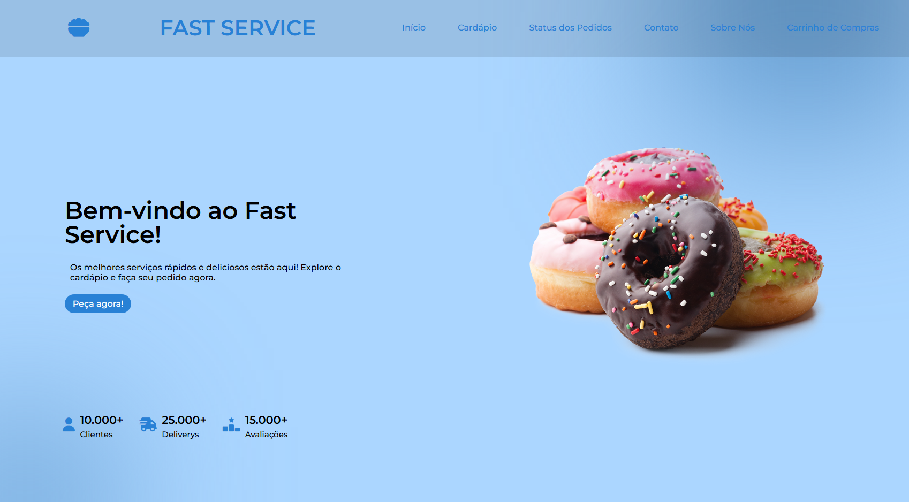
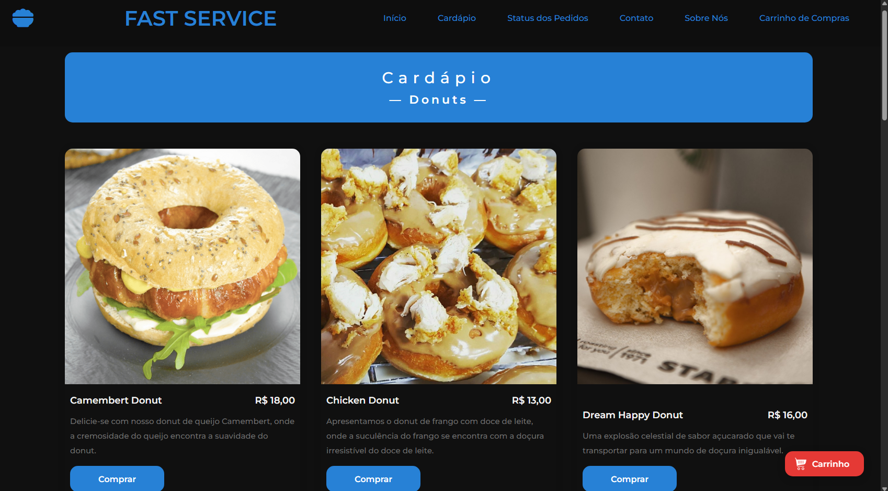
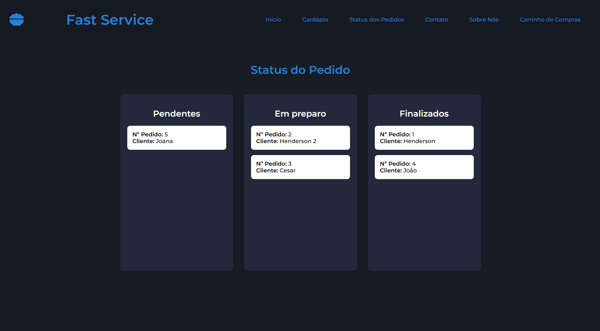
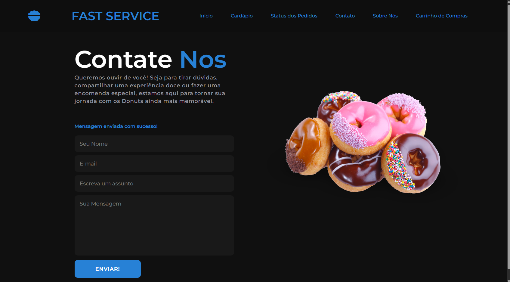
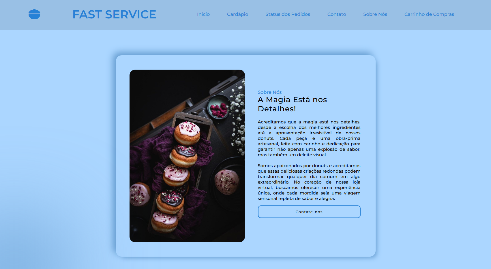
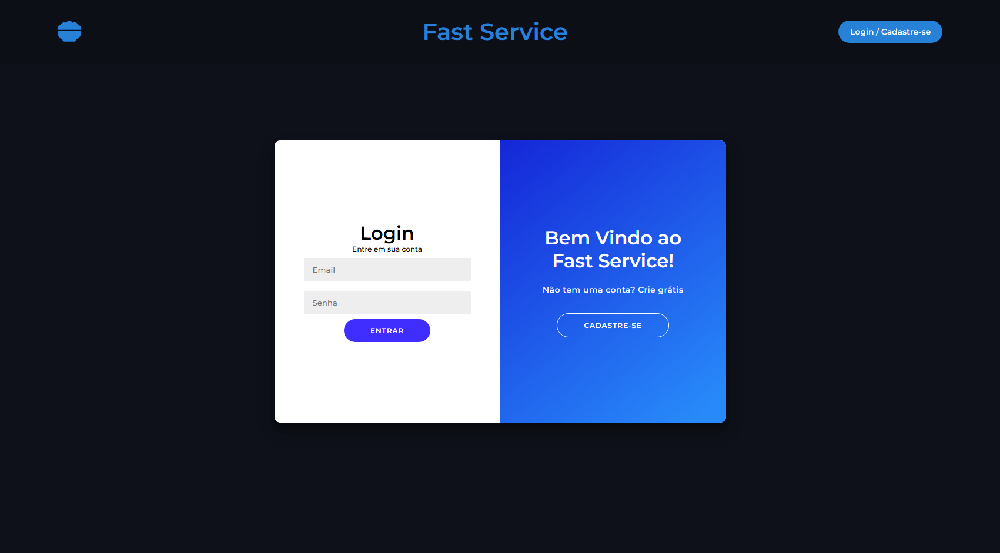
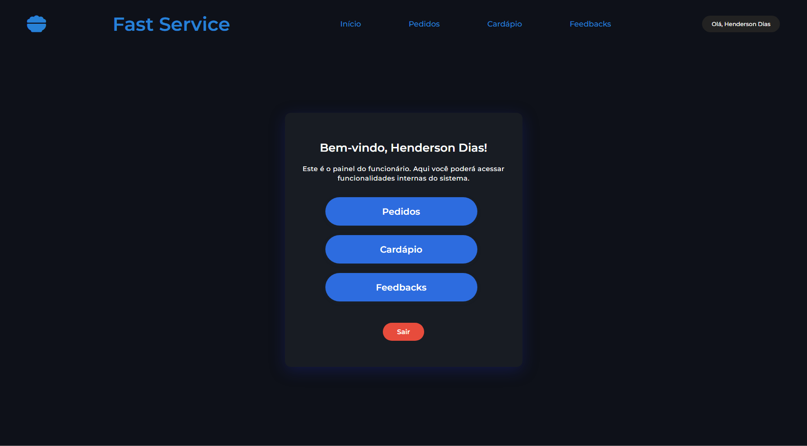
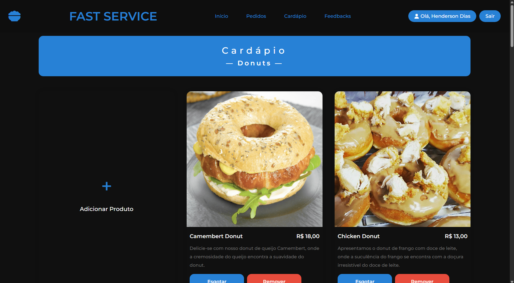
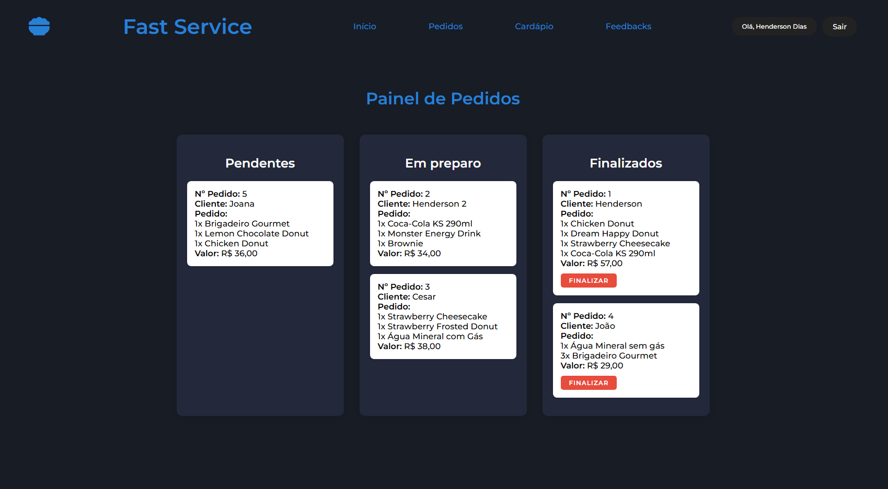
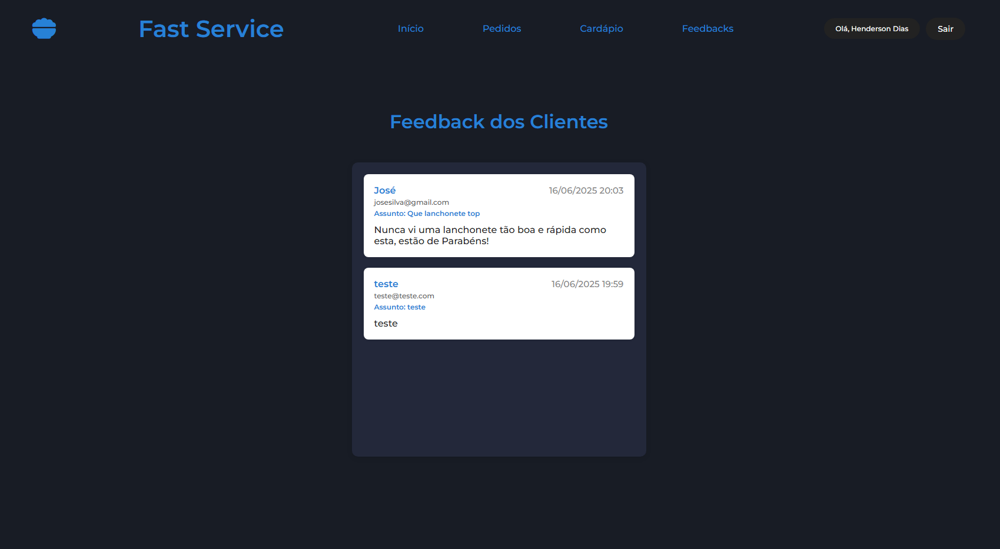

# 🍽️ Sistema de Autoatendimento para Restaurantes

Este projeto de TCC consiste em um sistema completo de autoatendimento para restaurantes, desenvolvido com tecnologias web. Ele simula o fluxo completo de pedidos, desde o cliente até o painel do funcionário, com um banco de dados relacional integrado.

## 🧾 Funcionalidades

### Área do Cliente:
- Acesso ao **cardápio dinâmico**.
- Adição de itens ao **carrinho**.
- **Finalização do pedido** com envio para o painel da cozinha.
- Tela de **Feedback's para o Restaurante**.
- Páginas institucionais: Sobre nós, Contato, etc.

### Área do Funcionário:
- Tela de Cadastro e Login para os funcionários.
- Painel de controle para **visualização e atualização do status dos pedidos** com sistema de **drag and drop** dos cards.
- Cadastro e edição de produtos do cardápio.
- Marcar itens como **esgotados**.
- Visualização dos **Feedback's recebidos** dos clientes.

## 💻 Tecnologias Utilizadas

- **HTML5** e **CSS3**: Interface responsiva.
- **JavaScript**: Interações dinâmicas (ex: carrinho, atualizações em tempo real).
- **PHP**: Lógica de back-end e integração com banco de dados.
- **MySQL**: Estrutura de banco de dados relacional.
- **AJAX**: Comunicação assíncrona entre cliente e servidor (sem recarregar a página).

## 📦 Como Rodar Localmente

### 🔧 Pré-requisitos
- Servidor local (como XAMPP) instalado.
- MySQL configurado.

### 🚀 Passos para rodar o projeto
1. Clone o repositório:
   ```bash
   git clone https://github.com/hendersondias/Sistema-de-Autoatendimento-para-Restaurantes/tree/System-v4.1
2. Mova os arquivos para a pasta htdocs do servidor local.
3. Acesse phpMyAdmin.
4. Importe o arquivo Cliente/database.sql.
5. Acesse no navegador:
   
http://localhost/Sistema-de-Autoatendimento-para-Restaurantes-System-v4.1/Cliente/
e
http://localhost/Sistema-de-Autoatendimento-para-Restaurantes-System-v4.1/Funcionario/

## 🤝 Contribuição
Contribuições são bem-vindas! Para contribuir:
- Faça um fork do projeto.
- Crie uma branch para sua feature (git checkout -b minha-feature).
- Commit suas alterações (git commit -m 'Adicionando nova funcionalidade').
- Envie um pull request.
  
## 📄 Licença
- Projeto acadêmico sem fins lucrativos. Uso livre para fins educacionais.

## 📌 Observações
Sistema didático voltado para simulação de um restaurante com autoatendimento.  
Dividido em dois painéis distintos para organização do fluxo de pedidos.

## 📷 Capturas de Tela
### Tela Inicial (Cliente)


### Tela do Cardápio(Cliente)


### Tela do Painel de Pedidos(Cliente)


### Tela do Painel de Contato(Cliente)


### Tela do Sobre Nós(Cliente)


### Tela de Login (Funcionário)


### Tela do Painel(Funcionário)


### Tela do Cardápio(Funcionário)


### Tela do Painel de Pedidos(Funcionário)


### Tela de Feedback's(Funcionário)



   
